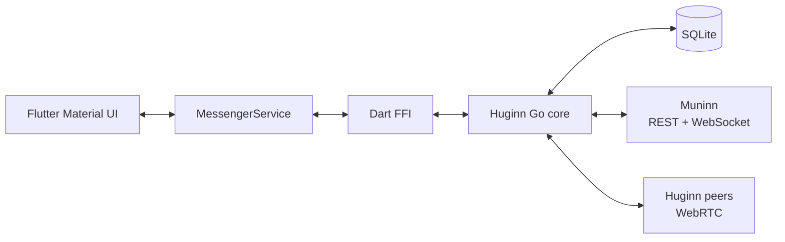

# Huginn Messenger — Flutter client

Кроссплатформенный Flutter-клиент P2P-мессенджера Huginn. UI написан на Dart,
а криптография, WebRTC, офлайн-доставка и SQLite реализованы в отдельном
Go-ядре. Клиент получает его как предсобранную versioned-библиотеку и подключает
через C ABI/Dart FFI.

Muninn используется для обнаружения endpoints, signaling и хранения метаданных
зашифрованных чанков. Тексты сообщений и содержимое файлов передаются между
Huginn-пирами.

## Возможности

- личные и групповые чаты;
- E2E-шифрование и подписи;
- прямая WebRTC-доставка и резервные offline chunks;
- отправка, фоновая загрузка и открытие файлов;
- ответы, пересылка и текстовые стикеры;
- поиск пиров и групп от трёх символов;
- relogin через текстовый ключ или QR-код;
- Android/Linux notifications и переход в чат по notification tap;
- настройка Muninn, chunk TTL и TURN.

## Архитектура



Подробности:

- [архитектура Flutter-приложения](docs/flutter-application.md);
- [архитектура Go-ядра](https://github.com/killbane1232/huginn-messenger/blob/main/docs/architecture.md);
- [README Go-ядра](https://github.com/killbane1232/huginn-messenger).

## Поддерживаемые сборки

| Платформа | Состояние |
|---|---|
| Android | Предсобранные библиотеки четырёх ABI загружаются через `build.sh` |
| Linux | Предсобранная библиотека упаковывается через CMake |
| iOS / macOS | Flutter runner есть, но native framework не входит в `build.sh` |
| Windows | Flutter runner есть, но native DLL не входит в `build.sh` |

## Подготовка

```bash
/usr/local/flutter/bin/flutter pub get
```

`build.sh` и GitHub Actions автоматически определяют последнюю версию
native-ядра через Go module proxy, загружают готовые Linux/Android артефакты из
соответствующего GitHub Release и проверяют их по `SHA256SUMS`. Для явного выбора
версии можно задать, например, `HUGINN_CORE_VERSION=v0.1.1`; адрес Go proxy
настраивается стандартной переменной `GOPROXY`.

Для работы требуются Flutter, `curl`, Android SDK для Android-сборки и Linux
desktop dependencies для Linux. Go нужен для определения последней версии ядра.
Android NDK нужен только репозиторию ядра, который публикует библиотеки.

## Проверка

```bash
/usr/local/flutter/bin/flutter analyze
/usr/local/flutter/bin/flutter test
```

## Release-сборка Android и Linux

```bash
./build.sh
```

Скрипт:

1. определяет последнюю версию Go-ядра, загружает и проверяет её Linux и Android libraries;
2. размещает Android libraries в `android/app/src/main/jniLibs`;
3. собирает release APK;
4. упаковывает Linux library в release bundle.

Результаты:

- `build/app/outputs/flutter-apk/app-release.apk`;
- `build/linux/x64/release/bundle/`.

Собранные `.so`, Flutter `build/`, `.dart_tool/`, `.gradle/` и platform
`ephemeral/` не должны редактироваться вручную или попадать в коммиты.

## Структура проекта

```text
lib/main.dart                         Material UI and navigation
lib/src/models/                       Dart models
lib/src/services/messenger_service.dart
lib/src/services/event_poller.dart
lib/src/services/notification_service.dart
lib/src/services/platform_service.dart
lib/src/ffi/messenger_bridge.dart     manual Dart FFI wrapper
scripts/download-core-libraries.sh    verified library downloader
native/linux/                         downloaded Linux library (ignored)
android/                              Android runner and Kotlin channels
linux/                                Linux runner and prebuilt CMake integration
test/                                 Flutter tests
docs/                                 Flutter documentation
```

## Конфигурация

По умолчанию клиент использует:

- Muninn: `https://muninn.evil-bread.ru`;
- chunk TTL: `1w`;
- SQLite: `huginn.db`;
- TURN: выключен до задания адреса.

На Android/iOS база размещается в application documents directory, на desktop
относительный путь разрешается от рабочей директории.

## Разработка FFI

Источником истины C ABI являются экспортированные функции в
[`bridge.go`](https://github.com/killbane1232/huginn-messenger/blob/main/bridge.go)
репозитория ядра. Изменение ABI нужно синхронно провести через:

1. Go exports;
2. C header;
3. `lib/src/ffi/messenger_bridge.dart`;
4. при необходимости generated bindings;
5. выпуск новой версии shared library и сборку целевой Flutter-платформы.

`flutter analyze` не проверяет runtime ABI и сетевое поведение Go-ядра.
