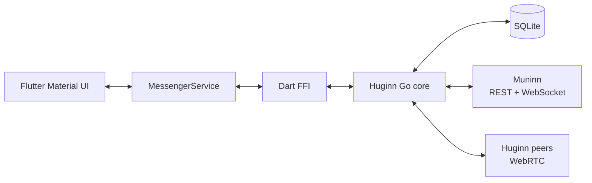

# Huginn Messenger — Flutter client

Кроссплатформенный Flutter-клиент P2P-мессенджера Huginn. UI написан на Dart,
а криптография, WebRTC, офлайн-доставка и SQLite реализованы в отдельном
Go-submodule `src/huginn-messenger` и подключены через C ABI/Dart FFI.

Muninn используется для обнаружения endpoints, signaling и хранения метаданных
зашифрованных чанков. Тексты сообщений и содержимое файлов передаются между
Huginn-пирами.

## Возможности

- личные и групповые чаты;
- E2E-шифрование и подписи;
- прямая WebRTC-доставка и резервные offline chunks;
- отправка, фоновая загрузка и открытие файлов;
- ответы, пересылка и текстовые стикеры;
- поиск пиров и групп от трёх символов;
- relogin через текстовый ключ или QR-код;
- Android/Linux notifications и переход в чат по notification tap;
- настройка Muninn, chunk TTL и TURN.

## Архитектура



Подробности:

- [архитектура Flutter-приложения](docs/flutter-application.md);
- [архитектура Go-ядра](src/huginn-messenger/docs/architecture.md);
- [README Go-submodule](src/huginn-messenger/README.md).

## Поддерживаемые сборки

| Платформа | Состояние |
|---|---|
| Android | Release-сборка четырёх ABI через `build.sh` |
| Linux | Go shared library собирается и упаковывается через CMake |
| iOS / macOS | Flutter runner есть, но native framework не входит в `build.sh` |
| Windows | Flutter runner есть, но native DLL не входит в `build.sh` |

## Подготовка

```bash
git submodule update --init --recursive --remote --checkout
/usr/local/flutter/bin/flutter pub get
```

Подмодуль настроен на ветку `main`; та же команда автоматически выполняется
в `build.sh` и GitHub Actions перед сборкой и тестами Flutter-приложения.

Для работы требуются Flutter, Go, а для Android также Android SDK и NDK.
Версии Dart/Flutter packages задаются в `pubspec.yaml`, Go modules — в
`src/huginn-messenger/go.mod`.

## Проверка

```bash
/usr/local/flutter/bin/flutter analyze
/usr/local/flutter/bin/flutter test

cd src/huginn-messenger
GOCACHE=/tmp/huginmunin-messenger-go-cache /usr/local/go/bin/go test ./...
```

## Release-сборка Android и Linux

```bash
./build.sh
```

Скрипт:

1. собирает host `libhuginn_messenger.so`;
2. cross-compile Go library для `arm64-v8a`, `armeabi-v7a`, `x86_64` и `x86`;
3. копирует Android libraries в `android/app/src/main/jniLibs`;
4. собирает release APK;
5. собирает Linux release bundle.

Результаты:

- `build/app/outputs/flutter-apk/app-release.apk`;
- `build/linux/x64/release/bundle/`.

Собранные `.so`, Flutter `build/`, `.dart_tool/`, `.gradle/` и platform
`ephemeral/` не должны редактироваться вручную или попадать в коммиты.

## Структура проекта

```text
lib/main.dart                         Material UI and navigation
lib/src/models/                       Dart models
lib/src/services/messenger_service.dart
lib/src/services/event_poller.dart
lib/src/services/notification_service.dart
lib/src/services/platform_service.dart
lib/src/ffi/messenger_bridge.dart     manual Dart FFI wrapper
src/huginn-messenger/bridge.go        exported C ABI
src/huginn-messenger/internal/        Go messenger core
android/                              Android runner and Kotlin channels
linux/                                Linux runner and Go CMake integration
test/                                 Flutter tests
docs/                                 Flutter documentation
```

## Конфигурация

По умолчанию клиент использует:

- Muninn: `https://muninn.evil-bread.ru`;
- chunk TTL: `1w`;
- SQLite: `huginn.db`;
- TURN: выключен до задания адреса.

На Android/iOS база размещается в application documents directory, на desktop
относительный путь разрешается от рабочей директории.

## Разработка FFI

Источником истины C ABI являются экспортированные функции в
`src/huginn-messenger/bridge.go`. Изменение ABI нужно синхронно провести через:

1. Go exports;
2. C header;
3. `lib/src/ffi/messenger_bridge.dart`;
4. при необходимости generated bindings;
5. сборку shared library и целевой Flutter-платформы.

`flutter analyze` не проверяет runtime ABI и сетевое поведение Go-ядра.
