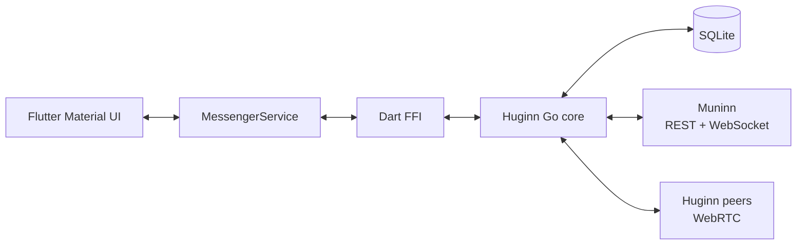

# Huginn Messenger — Flutter client

Кроссплатформенный Flutter-клиент P2P-мессенджера Huginn. UI написан на Dart,
а криптография, WebRTC, офлайн-доставка и SQLite реализованы в отдельном
Go-ядре. Клиент собирает его из submodule `src/huginn-messenger`, обновляя
исходники до последнего коммита `main`, и подключает через C ABI/Dart FFI.

Muninn используется для обнаружения endpoints, signaling и хранения метаданных
зашифрованных чанков. Тексты сообщений и содержимое файлов передаются между
Huginn-пирами.

## Возможности

- личные и групповые чаты;
- E2E-шифрование и подписи;
- прямая WebRTC-доставка и резервные offline chunks;
- отправка, фоновая загрузка и открытие файлов;
- ответы, пересылка и текстовые стикеры;
- поиск пиров и групп от трёх символов;
- relogin через текстовый ключ или QR-код;
- Android/Linux notifications и переход в чат по notification tap;
- настройка Muninn, chunk TTL и TURN.

Успешная отправка с обновлённым ядром означает сохранение сообщения и
зашифрованных вложений в SQLite для фоновой доставки. Очередь переживает
перезапуск. При ошибке подготовки клиент показывает причину и сохраняет текст
и непринятые вложения в редакторе; уже принятые вложения повторно не отправляются.
Исправления очереди должны присутствовать в `main` ядра; библиотека
пересобирается вместе с клиентом.

## Архитектура


```mermaid
flowchart LR
    UI[Flutter Material UI]
    Service[MessengerService]
    FFI[Dart FFI]
    Go[Huginn Go core]
    DB[(SQLite)]
    Muninn[Muninn<br/>REST + WebSocket]
    Peers[Huginn peers<br/>WebRTC]

    UI <--> Service
    Service <--> FFI
    FFI <--> Go
    Go <--> DB
    Go <--> Muninn
    Go <--> Peers
```

Подробности:

- [архитектура Flutter-приложения](docs/flutter-application.md);
- [архитектура Go-ядра](https://github.com/killbane1232/huginn-messenger/blob/main/docs/architecture.md);
- [README Go-ядра](https://github.com/killbane1232/huginn-messenger).

## Поддерживаемые сборки

| Платформа | Состояние |
|---|---|
| Android | Библиотеки четырёх ABI собираются из submodule через `build.sh` |
| Linux | Библиотека собирается из submodule и упаковывается через CMake |
| iOS / macOS | Flutter runner есть, но native framework не входит в `build.sh` |
| Windows | Flutter runner есть, но native DLL не входит в `build.sh` |

## Подготовка

```bash
/usr/local/flutter/bin/flutter pub get
```

`build.sh` и GitHub Actions вызывают `scripts/build-core-libraries.sh`, который
обновляет submodule командой `git submodule update --init --recursive --remote
--checkout -- src/huginn-messenger` и компилирует shared libraries. В
`.gitmodules` задано `branch = main`. Git всё равно хранит SHA подмодуля, но
перед каждой сборкой скрипт получает последний `main`; использованный SHA
выводится в лог. При ошибке обновления или незакоммиченных изменениях ядра
сборка останавливается. Для обновления нужен доступ к Git remote.

Сборочный скрипт запускается на Linux. Нужны Git, Go, C-компилятор, Flutter,
Android SDK/NDK для Android и Linux desktop dependencies для Linux.
Путь к NDK можно задать через `ANDROID_NDK_HOME` или `ANDROID_NDK_ROOT`;
иначе выбирается последняя установленная версия из `$ANDROID_HOME/ndk`
(`ANDROID_SDK_ROOT` или `~/Android/Sdk` используются как запасные пути).
CI устанавливает NDK `28.2.13676358`.

Отдельная сборка библиотек перед прямым вызовом `flutter build`:

```bash
scripts/build-core-libraries.sh linux    # только Linux
scripts/build-core-libraries.sh android  # только Android, четыре ABI
scripts/build-core-libraries.sh          # Linux и Android
```

## Проверка

```bash
/usr/local/flutter/bin/flutter analyze
/usr/local/flutter/bin/flutter test
```

Нативный тест ошибок отправки, сохранения очереди и настройки Muninn запускается
с пересобранной Linux-библиотекой:

```bash
scripts/build-core-libraries.sh linux
HUGINN_NATIVE_TESTS=1 LD_LIBRARY_PATH="$PWD/native/linux/amd64" \
  /usr/local/flutter/bin/flutter test
```

На Linux ARM64 используйте `native/linux/arm64`. Проверка обновления submodule
и сборочного скрипта без доступа к сети: `python3 scripts/test_build_core.py`.

## Release-сборка Android и Linux

```bash
./build.sh
```

Скрипт:

1. обновляет Go-submodule до последнего `main` и собирает Linux и Android libraries;
2. размещает Android libraries в `android/app/src/main/jniLibs`;
3. собирает release APK;
4. упаковывает Linux library в release bundle.

Результаты:

- `build/app/outputs/flutter-apk/app-release.apk`;
- `build/linux/x64/release/bundle/`.

Собранные `.so`, Flutter `build/`, `.dart_tool/`, `.gradle/` и platform
`ephemeral/` не должны редактироваться вручную или попадать в коммиты.

## Структура проекта

```text
lib/main.dart                         Material UI and navigation
lib/src/models/                       Dart models
lib/src/services/messenger_service.dart
lib/src/services/event_poller.dart
lib/src/services/notification_service.dart
lib/src/services/platform_service.dart
lib/src/ffi/messenger_bridge.dart     manual Dart FFI wrapper
src/huginn-messenger/                 Go core submodule (main)
scripts/build-core-libraries.sh       submodule update and native build
native/linux/                         compiled Linux library (ignored)
android/                              Android runner and Kotlin channels
linux/                                Linux runner and CMake library packaging
test/                                 Flutter tests
docs/                                 Flutter documentation
```

## Конфигурация

Начальный адрес Muninn задаётся ключом `muninn` в `assets/config.json`,
который включается в сборку. Измените этот файл перед сборкой для своего
сервера. При следующих запусках используется адрес, сохранённый в SQLite.
Поле **Settings → Muninn server** сохраняет новый адрес и сразу пересоздаёт
подключение; одновременно можно изменить login.

Для этой загрузки конфигурации нужна обновлённая shared library ядра: пустой
адрес в `messenger_create` загружает SQLite и возвращает `-4`, если адрес
ещё не задан. Изменения ядра должны быть в `main` перед сборкой клиентов.

Остальные значения по умолчанию:

- chunk TTL: `1w`;
- SQLite: `huginn.db`;
- TURN: выключен до задания адреса.

На Android/iOS база размещается в application documents directory, на desktop
относительный путь разрешается от рабочей директории.

## Разработка FFI

Источником истины C ABI являются экспортированные функции в
[`bridge.go`](https://github.com/killbane1232/huginn-messenger/blob/main/bridge.go)
репозитория ядра. Изменение ABI нужно синхронно провести через:

1. Go exports;
2. C header;
3. `lib/src/ffi/messenger_bridge.dart`;
4. при необходимости generated bindings;
5. обновление `main` ядра, пересборку shared library и целевой Flutter-платформы.

`flutter analyze` не проверяет runtime ABI и сетевое поведение Go-ядра.
