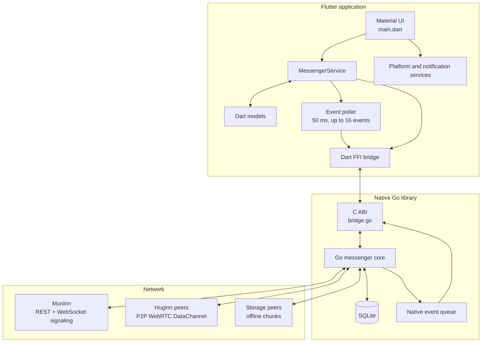
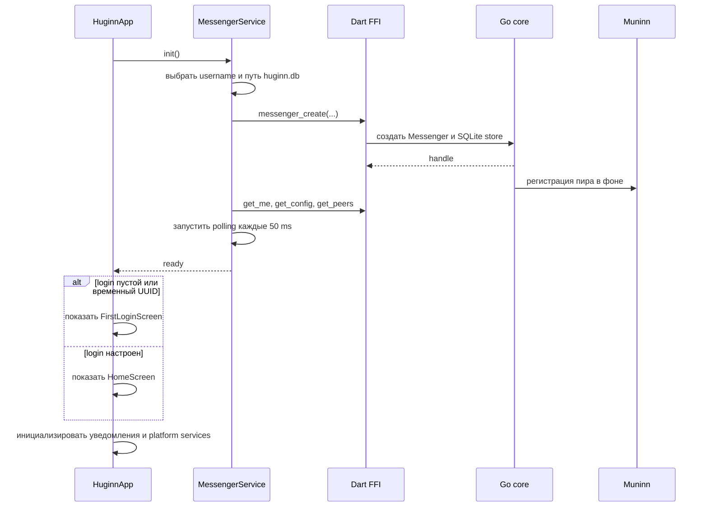
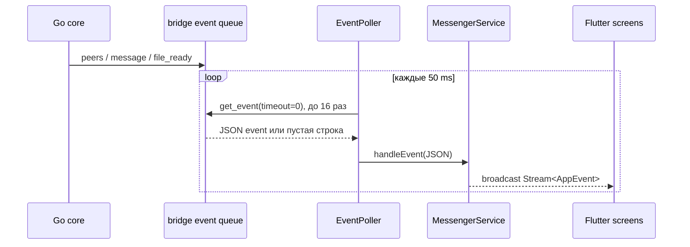

# Flutter-приложение Huginn Messenger

Этот документ описывает актуальный Flutter-клиент из каталога
`huginn_messenger`. Сетевой протокол, криптография, WebRTC и SQLite находятся
не в Dart-коде, а в Go-ядре `src/huginn-messenger`, подключённом через C ABI и
Dart FFI.

Документ составлен по состоянию кода на 11 августа 2026 года. Раздел
[Сверка с существующими схемами](#сверка-с-существующими-схемами) фиксирует
границы Flutter, standalone Go UI и Muninn после синхронизации документации.

## Назначение приложения

Flutter-клиент предоставляет пользовательский интерфейс для:

- первого входа и переноса существующей идентичности;
- поиска прямых контактов и групп;
- личных и групповых чатов;
- отправки текста, файлов и текстовых стикеров;
- ответов на сообщения и пересылки;
- локальных уведомлений и перехода в чат по нажатию на уведомление;
- настройки Muninn, TTL чанков и TURN;
- открытия загруженных вложений средствами операционной системы.

Flutter не реализует собственный сервер сообщений. Muninn используется для
регистрации и обнаружения пиров, WebRTC-сигналинга и метаданных офлайн-чанков.
Содержимое сообщений и файлов передаётся между Huginn-пирами.

## Архитектура



### Границы ответственности

| Слой | Ответственность |
|---|---|
| `lib/main.dart` | Навигация, экраны, состояние виджетов и пользовательские действия |
| `lib/src/services/` | Фасад Go-ядра, поток событий, уведомления и платформенная интеграция |
| `lib/src/models/` | Dart-представления конфигурации, пиров, групп, сообщений и событий |
| `lib/src/ffi/messenger_bridge.dart` | Ручная загрузка динамической библиотеки и вызовы экспортированного C ABI |
| `src/huginn-messenger/bridge.go` | Таблица native-инстансов, JSON-контракт с Dart и очередь событий |
| `src/huginn-messenger/internal/` | Криптография, доставка, WebRTC, Muninn-клиент и SQLite-хранилище |
| platform runners | Упаковка native-библиотеки и функции конкретной ОС |

Ключевые правила границы Flutter/Go:

- каждый вызов FFI получает числовой `handle` native-инстанса;
- сложные аргументы и результаты передаются как JSON-строки;
- строки, выделенные Go, Dart освобождает через `messenger_free_string`;
- изменение C ABI должно одновременно обновлять `bridge.go`, заголовок и
  Dart-обёртку;
- логика доставки и хранения не должна дублироваться в UI.

## Структура Flutter-проекта

```text
huginn_messenger/
├── lib/
│   ├── main.dart                         # Material UI и навигация
│   ├── huginn_messenger.dart             # публичные Dart-экспорты
│   ├── huginn_messenger_bindings_generated.dart
│   └── src/
│       ├── ffi/messenger_bridge.dart      # используемая ручная FFI-обёртка
│       ├── models/                        # AppConfig, Peer, GroupChat и сообщения
│       └── services/                      # messenger, events, platform, notifications
├── test/                                  # Flutter unit/widget tests
├── android/                               # Android runner, Kotlin channels и jniLibs
├── linux/                                 # Linux runner и CMake-сборка Go-библиотеки
├── ios/ macos/ windows/                   # runners без полной сборки в build.sh
├── src/huginn-messenger/                  # отдельный Git submodule с Go-ядром
├── pubspec.yaml
└── build.sh                               # release-сборка Go + Android + Linux
```

`lib/main.dart` пока содержит большую часть экранов в одном файле. При
дальнейшем разделении важно сохранить один долгоживущий `MessengerService` на
уровне `HuginnApp` и передавать его дочерним экранам.

## Жизненный цикл приложения



При первом запуске Dart создаёт временный UUID, если имя пользователя ещё не
известно. `FirstLoginScreen` требует обычный непустой login либо позволяет на
Android считать QR-код relogin. После смены login или успешного relogin
`MessengerService` уничтожает старый native-инстанс и создаёт новый с той же
базой данных.

При завершении Flutter отменяет подписки и таймер, вызывает
`messenger_destroy`, останавливает Android foreground service и закрывает
контроллеры потоков.

## Идентификаторы

В приложении различаются три значения:

- `peer_id` — идентификатор конкретного WebRTC endpoint;
- `login` — отображаемое имя пользователя;
- `Peer.key` — ключ маршрутизации вида `login:signature_key`.

В UI показывается `Peer.displayLogin`, а для открытия чата, поиска истории и
отправки используется полный ключ. Для группы ключом чата служит её `uid`.
Смешивание отображаемого имени и ключа маршрутизации приводит к объединению
разных собеседников или к загрузке чужой истории.

## Экраны и пользовательские сценарии

### Первый вход

`FirstLoginScreen` появляется, если сохранённый login пуст или имеет вид UUID.
Доступны два сценария:

1. Ввести новый login. Значение сохраняется в конфигурации Go-ядра, после чего
   native-инстанс пересоздаётся.
2. На Android считать relogin QR-код с другого устройства и импортировать
   идентичность и локальное состояние.

### Главный экран

`HomeScreen` показывает группы и прямые контакты в общем списке. С экрана можно:

- обновить список pull-to-refresh;
- создать группу;
- открыть личный или групповой чат;
- перейти в настройки;
- искать пиры и группы.

Поиск начинается только после трёх символов. До достижения порога показывается
обычный список, а события обновления пиров продолжают использоваться как
основной источник состояния.

### Чат

`ChatScreen` загружает последние 64 сообщения и добавляет более старые страницы
при прокрутке к началу списка. Событие применяется только к чату с совпадающим
`chat_id`; для старых событий без `chat_id` сообщение дополнительно сверяется с
историей текущего чата.

Поддерживаются:

- текст и несколько файлов за одну пользовательскую отправку;
- предпросмотр локальных изображений;
- открытие загруженного файла по нажатию;
- ответы и пересылка, закодированные в обычном тексте;
- категории текстовых стикеров;
- приглашение участника из группового чата;
- локальное отображение UTC-времени через `DateTime.toLocal()`.

На Android свайп сообщения влево начинает ответ, а долгое нажатие открывает
пересылку. На Linux, macOS и Windows эти действия доступны через контекстное
меню правой кнопки мыши.

### Настройки

`SettingsScreen` редактирует:

- login;
- адрес Muninn;
- TTL офлайн-чанков: один день, неделя или месяц;
- адрес и учётные данные TURN;
- relogin-ключ.

Изменение login сразу пересоздаёт native-инстанс. Простое сохранение Muninn,
TTL или TURN записывает конфигурацию, но не перестраивает уже созданные сетевые
клиенты. Для гарантированного применения этих параметров нужен перезапуск или
явное пересоздание `MessengerService`.

## Поток событий Go → Flutter

Go-bridge подписывается на события ядра и помещает их в очередь ёмкостью 100:

| Тип | Dart-модель | Назначение |
|---|---|---|
| `peers` | `PeersEvent` | Полный обновлённый список пиров |
| `message` | `MessageEvent` | Новое входящее или локально сохранённое сообщение |
| `file_ready` | `FileReadyEvent` | Файл полностью восстановлен и доступен по локальному пути |

Flutter каждые 50 мс вызывает `messenger_get_event(handle, 0)` и забирает до
16 событий за один tick. Вызов неблокирующий, поэтому polling не ждёт внутри
native-кода.



Очередь Go и broadcast-потоки не являются постоянным журналом: при переполнении
native-очереди событие отбрасывается, а подписчик, подключённый позже, старое
событие не получит. Восстановление состояния должно опираться на SQLite через
`getMessagesPaginated`, `getPeers` и `getGroups`.

## Отправка и доставка

`MessengerService.sendMessage` и `sendFile` вызывают C ABI, который ставит
работу в ограниченную очередь Go. Успешный синхронный результат означает, что
задача принята ядром, а не то, что адресат уже получил данные. Ошибки поиска
пира, шифрования или сети после постановки задачи доступны только в native-логе.

Для текста ядро пытается открыть прямой WebRTC DataChannel. При успешной прямой
отправке оно также создаёт офлайн-представление сообщения, чтобы сохранить
резервный путь доставки. Файлы и недоступные получатели используют зашифрованные
чанки размером 1 KiB, зарегистрированные в Muninn и размещённые у storage-пиров.

Сигналинг между Huginn и Muninn идёт по WebSocket `/api/v1/ws`. Если WebSocket
недоступен, остаётся HTTP polling сигналов каждые 500 мс. После установки
соединения полезная нагрузка идёт напрямую между Huginn-пирами по WebRTC.

## Файлы

Отправка файла начинается с `file_picker`. Go-ядро читает локальный файл,
шифрует и распределяет его чанки, а в сообщении сохраняет `FileMeta`. У
получателя сообщение может появиться до готовности самого файла.

После восстановления файла Go отправляет `file_ready`. `MessengerService`
сохраняет соответствие `file_id → local path`, а открытый `ChatScreen`
перерисовывает вложение. Если файла ещё нет, UI показывает `File is not
available yet`.

На Android файлы сохраняются в `Downloads/Huginn`, открываются через
`FileProvider` и требуют storage access. На desktop используются системные
команды `xdg-open`, `open` или `explorer.exe`.

## Группы

Группа хранится в SQLite как `GroupChat` с `uid`, именем и отдельными ключами.
Приглашение передаётся как зашифрованное личное сообщение со служебным payload;
получатель импортирует групповые ключи и видит человекочитаемое уведомление о
вступлении.

Flutter использует обычный `sendMessage(groupUid, ...)`. Go-ядро распознаёт
`uid` как локальную группу, подставляет групповые ключи и направляет сообщение
через офлайн-чанки. Не следует добавлять отдельный Dart-протокол групповых
сообщений без соответствующей необходимости в C ABI.

## Relogin

Исходное устройство создаёт подписанный challenge и показывает его как QR-код
и текст. Целевое устройство передаёт его Go-ядру, соединяется с источником и
получает:

- криптографическую идентичность;
- историю сообщений;
- прямые контакты;
- группы;
- метаданные файлов без локальных путей.

Снимок передаётся по WebRTC частями до 32 KiB, сжимается gzip и проверяется по
SHA-256 перед транзакционным импортом. Содержимое файлов загружается позднее в
фоне. Физический endpoint `peer_id` целевого устройства сохраняется.

Relogin заменяет ключи целевой идентичности. QR-код и текстовый ключ следует
передавать только доверенному устройству и не включать в логи или скриншоты.

## Платформенная интеграция

| Платформа | Текущее состояние |
|---|---|
| Android | Есть сборка четырёх ABI, foreground service, уведомления, QR-сканер, downloads и `FileProvider` |
| Linux | Есть CMake-сборка Go shared library, `notify-send` и `xdg-open`; входит в `build.sh` |
| iOS / macOS | Dart умеет загрузить framework, но `build.sh` не собирает и не упаковывает его |
| Windows | Dart умеет загрузить DLL, но `build.sh` не собирает и не упаковывает её |

Android foreground service показывает постоянное low-priority уведомление и
помогает сохранять процесс приложения. Отдельного headless Dart isolate он не
создаёт: после остановки процесса Flutter polling событий выполняться не будет.

Android-уведомления используют канал `huginn_messages`; payload содержит
`chat_id`. Обрабатываются как нажатия при работающем приложении, так и запуск из
уведомления. На Linux уведомления отправляются через `notify-send`.

## Конфигурация и локальные данные

Значения по умолчанию:

| Параметр | Значение |
|---|---|
| Muninn | `https://muninn.evil-bread.ru` |
| Chunk TTL | `1w` |
| Database | `huginn.db` |
| TURN | выключен, пока адрес пуст |

На Android и iOS база создаётся в application documents directory. На desktop
относительный путь `huginn.db` разрешается от текущей рабочей директории.
Конфигурация, ключи, контакты, группы и история принадлежат Go-хранилищу SQLite.

Нельзя логировать приватные ключи, тексты сообщений, TURN credentials и пути с
чувствительными данными. Локальные базы, `jniLibs/*.so` и другие собранные
бинарники не должны попадать в коммиты.

## Сборка и проверка

Работать нужно из Git-репозитория `huginn_messenger`, а команды Go выполнять в
отдельном submodule.

```bash
cd /home/killbane/git/huginmunin/huginn_messenger
git submodule update --init --recursive
/usr/local/flutter/bin/flutter pub get
/usr/local/flutter/bin/flutter analyze
/usr/local/flutter/bin/flutter test
```

Полная release-сборка Android и Linux, включая Go shared libraries:

```bash
cd /home/killbane/git/huginmunin/huginn_messenger
./build.sh
```

Результаты:

- Android APK: `build/app/outputs/flutter-apk/app-release.apk`;
- Linux bundle: `build/linux/x64/release/bundle/`.

Для изменения Go-ядра:

```bash
cd /home/killbane/git/huginmunin/huginn_messenger/src/huginn-messenger
GOCACHE=/tmp/huginmunin-messenger-go-cache /usr/local/go/bin/go test ./...
/usr/local/go/bin/go build -ldflags='-checklinkname=0' \
  -buildmode=c-shared -o /tmp/libhuginn_messenger.so .
```

Сборка только Flutter-кода не подтверждает совместимость C ABI. После изменения
границы Dart/Go нужна как минимум сборка shared library и целевой платформы.

## Сверка с существующими схемами

Проверены и синхронизированы внешний [README](../README.md), README
[Go-submodule](../src/huginn-messenger/README.md), подробная
[architecture.md](../src/huginn-messenger/docs/architecture.md) и README
[Muninn](../../muninn/README.md).

| Документ | Область ответственности |
|---|---|
| `huginn_messenger/README.md` | Обзор Flutter-репозитория, сборка и ссылки на подробные документы |
| `docs/flutter-application.md` | Flutter UI, FFI, platform services и пользовательские сценарии |
| `src/huginn-messenger/README.md` | Запуск и использование standalone Go-приложения |
| `src/huginn-messenger/docs/architecture.md` | Доставка, WebRTC, chunks, группы, relogin, web UI и C ABI |
| `muninn/README.md` | Directory API, signaling, chunk metadata и stores Muninn |

Критические границы теперь описаны одинаково:

- Muninn signaling использует WebSocket `/api/v1/ws`; HTTP signals доступны как
  optional fallback;
- Flutter получает события через `messenger_get_event`, а SSE относится только
  к standalone web UI;
- размер payload-части равен 1024 байтам;
- metadata получателя запрашиваются через `/api/v1/recipient/chunks`;
- `pendingChunkLoop` работает каждые десять секунд и ограничен TTL;
- группа не является отдельным WebRTC endpoint и не имеет
  `groupHeartbeatLoop`;
- relogin переносит gzip/SHA-256 snapshot чанками до 32 KiB и оставляет файлы
  для фоновой загрузки.

## Источники истины для сопровождения

- Flutter-поток и UX: `lib/main.dart`.
- Dart/native контракт: `lib/src/ffi/messenger_bridge.dart` и
  `src/huginn-messenger/bridge.go`.
- Доставка и фоновые циклы: `src/huginn-messenger/internal/messenger/`.
- Signal transport: `src/huginn-messenger/internal/muninn/rtc.go`.
- Muninn routes: [`muninn/internal/api/server.go`](../../muninn/internal/api/server.go)
  в соседнем Git-репозитории.
- Платформенные возможности: Android manifest/Kotlin и Linux CMake runner.
- Версии зависимостей: `pubspec.yaml` и `go.mod`, а не примеры в README.
