# Huginn Messenger — архитектура передачи сообщений

## 1. Регистрация пира и heartbeat

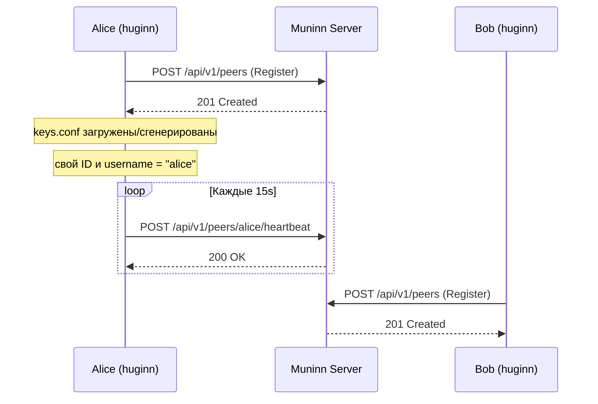

Каждый экземпляр Huginn при старте регистрируется на Muninn-сервере, передавая свои публичные ключи (encryption + signing), метаданные и TTL (120s). Каждые 15 секунд отправляется heartbeat, продлевающий регистрацию. Если heartbeat не пришёл вовремя — пир считается офлайн.

---

## 2. Поиск пиров

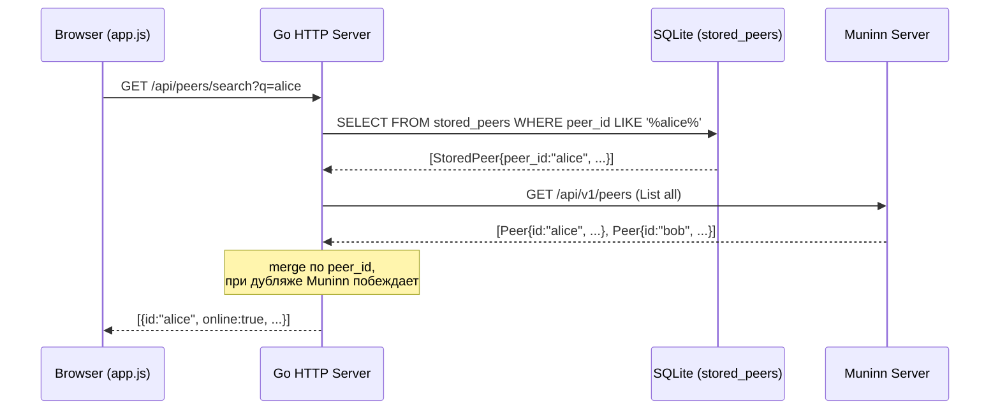

Поиск работает в два слоя: сначала SQLite (`stored_peers` — пиры, с которыми уже было взаимодействие), затем Muninn (все зарегистрированные пиры). Результаты мержатся по `peer_id`.

---

## 3. WebRTC Signaling (установка P2P-канала)

WebRTC-соединение устанавливается через сигнальный обмен offer/answer. Есть два механизма: новый — через постоянное WebRTC-соединение с Muninn (рекомендуемый), и старый — через HTTP polling (fallback).

### 3a. WebRTC-to-Muninn (новый, основной)

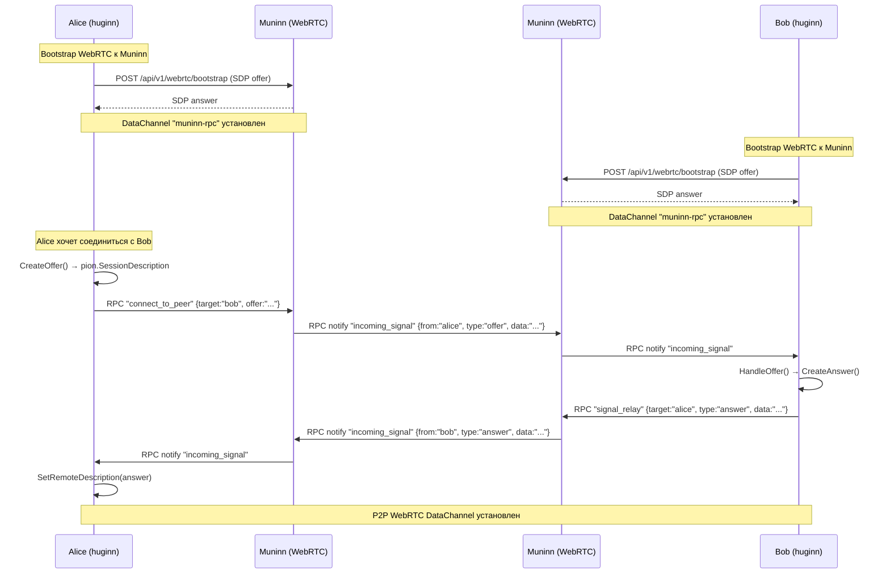

Клиент при старте устанавливает постоянное WebRTC-соединение с сервером Muninn (bootstrap через одноразовый HTTP-запрос). Все последующие сигналы обмена offer/answer передаются мгновенно через это соединение в виде RPC-сообщений, без HTTP polling.

### 3b. HTTP Polling (старый, fallback)

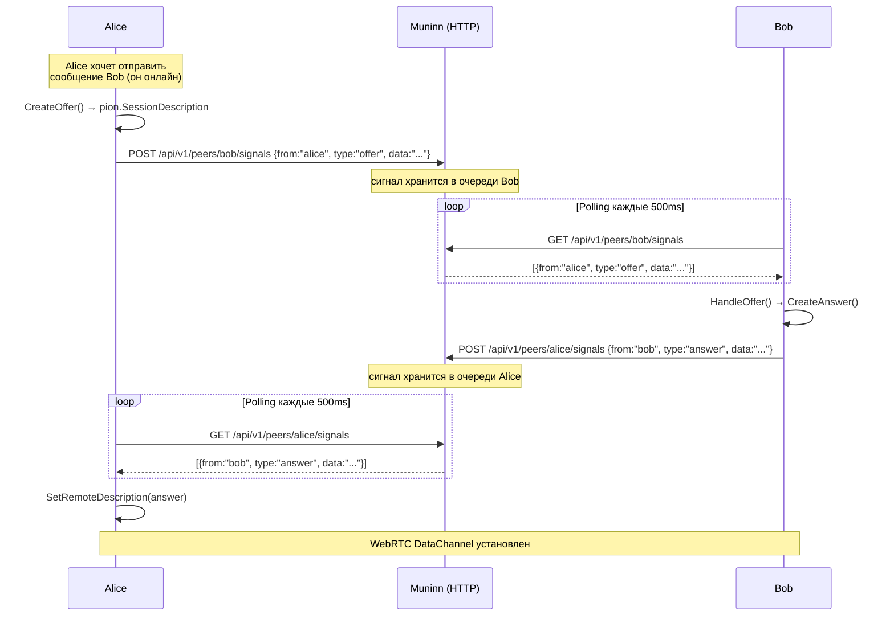

Если WebRTC-соединение с Muninn недоступно, клиент автоматически переключается на HTTP polling (каждые 500ms) для обмена сигналами. Сервер Muninn при получении RPC-сигнала для пира, не подключённого через WebRTC, сохраняет сигнал в Store — пир заберёт его через HTTP.

---

## 4. Онлайн-доставка (WebRTC)

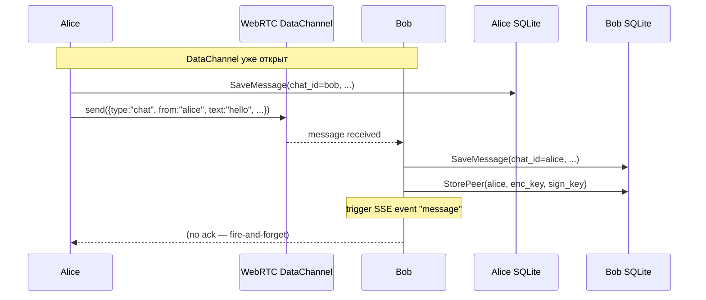

Если WebRTC-канал открыт, сообщение отправляется напрямую через DataChannel. Отправитель сохраняет сообщение у себя в БД, получатель — у себя. Никаких подтверждений доставки не предусмотрено (fire-and-forget).

---

## 5. Офлайн-доставка (Chunks)

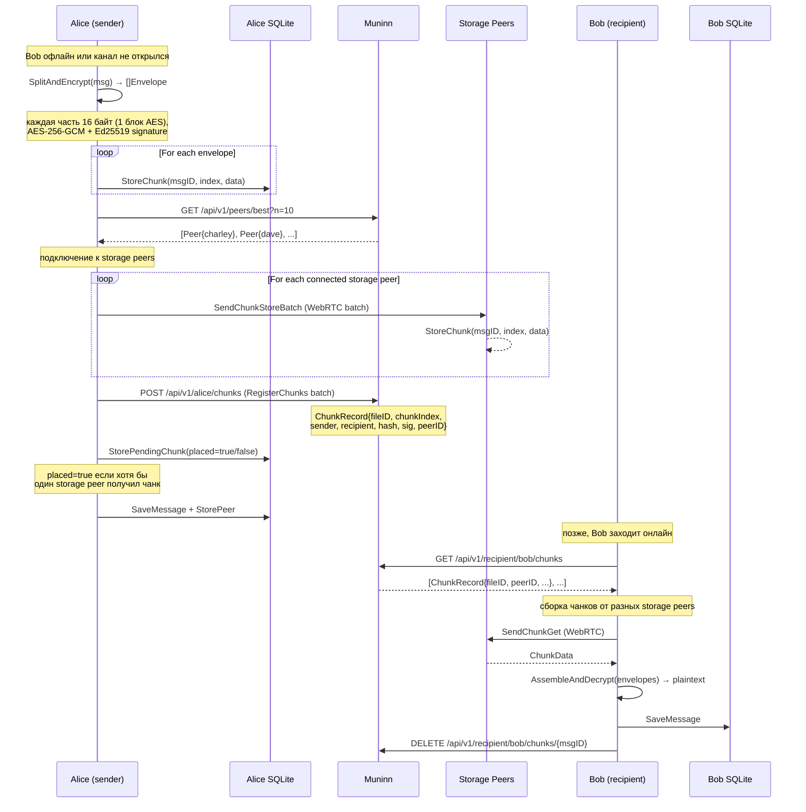

Если P2P-канал не открылся (пир офлайн), сообщение разбивается на 1KB-зашифрованные чанки. Каждый чанк сохраняется локально и реплицируется на соседние онлайн-пиры (storage peers). Метаданные о местоположении чанков регистрируются на Muninn. Получатель периодически опрашивает Muninn о новых чанках для себя, собирает их со storage peers и дешифрует.

---

## 6. Фоновая репликация чанков

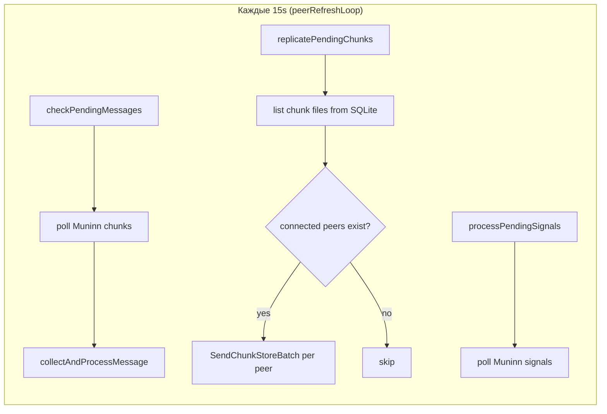

В цикле `peerRefreshLoop` (15s) выполняются три задачи:
- **checkPendingMessages** — опрос Muninn на предмет новых чанков, адресованных нам
- **replicatePendingChunks** — распространение локально хранящихся чанков на подключённых пиров
- **processPendingSignals** — обработка WebRTC-сигналов (offer/answer)

---

## 7. Фоновая отправка неразмещённых чанков

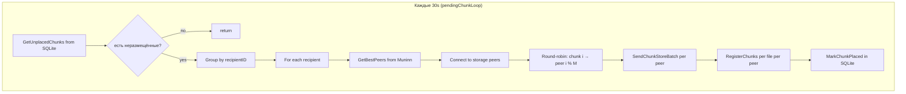

Отдельная горутина `pendingChunkLoop` (30s) обрабатывает чанки, которые не удалось разместить при первой отправке (`placed=false`). Чанки группируются по получателю, затем распределяются по доступным storage peers по кругу (round-robin), отправляются батчами через WebRTC и регистрируются на Muninn.

---

## 8. Жизненный цикл pending_chunk

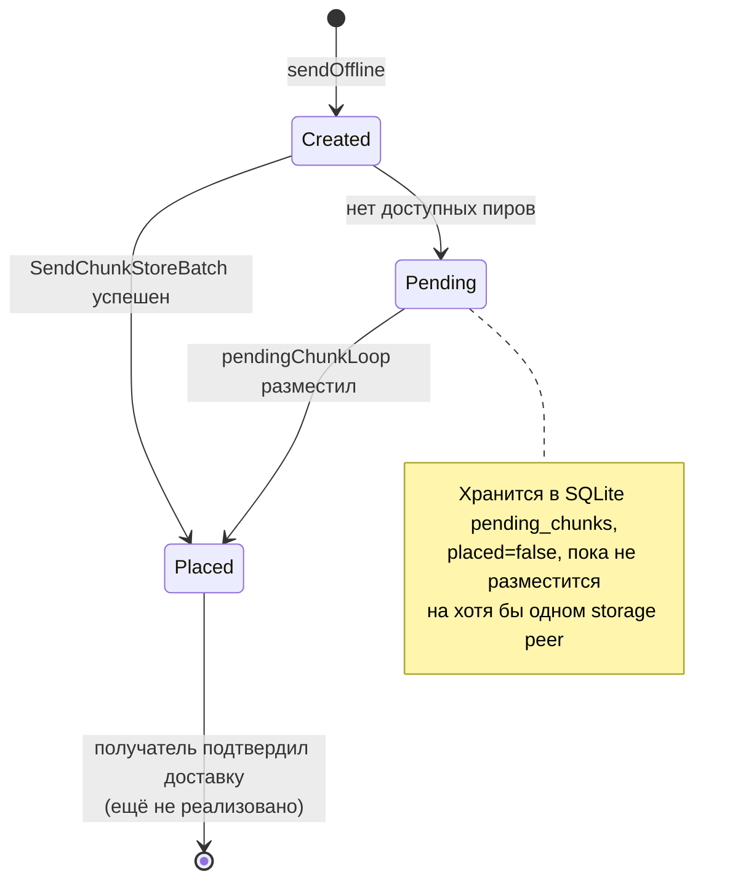

Чанк создаётся в `sendOffline`. Если хотя бы один storage peer его получил — `placed=true`. Если нет — `placed=false`, и фоновый процесс будет пытаться разместить его навсегда (пока не появится механизм подтверждения доставки).

---

## 9. SSE-события (real-time UI)

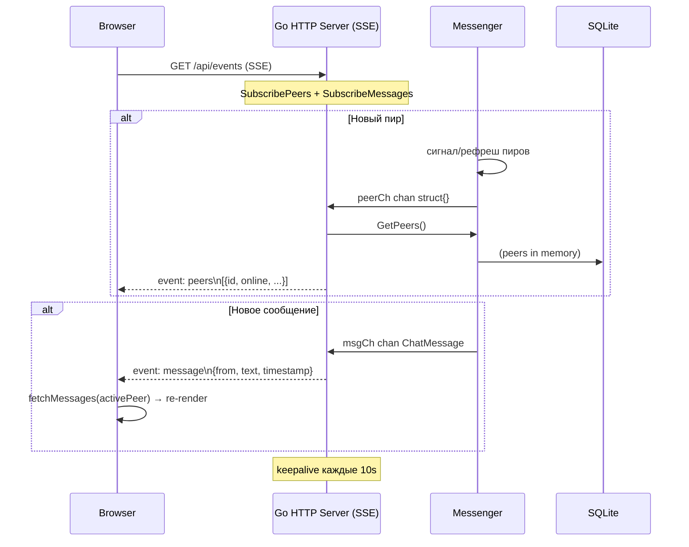

---

## 10. Пользовательский поиск (UI → API)

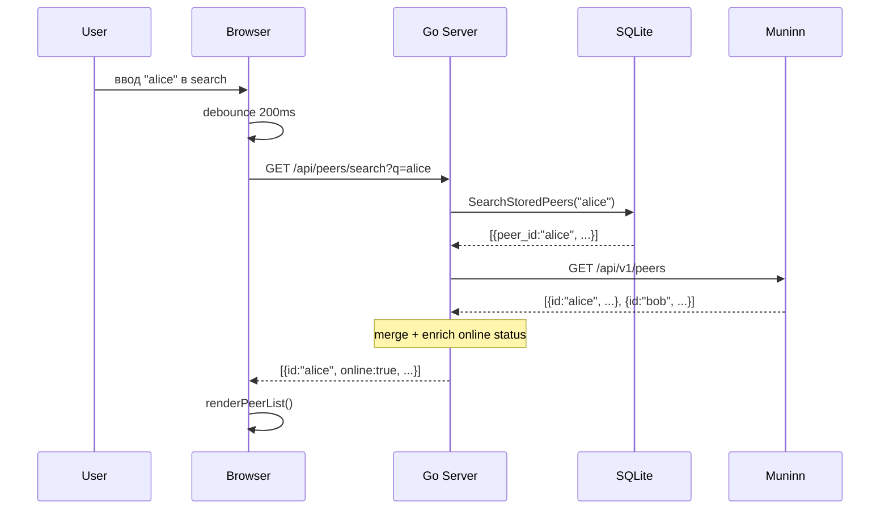

Поиск на фронтенде с дебаунсом (200ms). При пустом запросе — возвращается полный список через стандартный `/api/peers`. При непустом — `/api/peers/search?q=...` с поиском по локальному SQLite + Muninn.

---

## 11. WebRTC RPC Protocol (клиент-серверный канал с Muninn)

Для замены HTTP polling сигналов используется постоянное WebRTC-соединение между каждым клиентом Huginn и сервером Muninn. Поверх DataChannel работает RPC-протокол.

### Bootstrap (HTTP → WebRTC)

```
POST /api/v1/webrtc/bootstrap
Headers: X-Peer-ID: <peer_id>
Body: pion.SessionDescription (SDP offer)
Response: pion.SessionDescription (SDP answer)
```

Одноразовый HTTP-запрос для начального handshake. Клиент создаёт `PeerConnection` и DataChannel `"muninn-rpc"`, отправляет SDP offer. Сервер создаёт answer. После этого всё общение идёт через WebRTC DataChannel.

### Протокол сообщений (DataChannel)

Все сообщения — JSON. Есть три типа:

**Request** (клиент → сервер):
```json
{"id": "uuid", "method": "method_name", "params": {...}}
```

**Response** (сервер → клиент):
```json
{"id": "uuid", "result": {...}, "error": ""}
```

**Notification** (сервер → клиент):
```json
{"method": "method_name", "params": {...}}
```

### RPC-методы

| Метод | Направление | Описание |
|-------|-------------|----------|
| `connect_to_peer` | client → server | Запрос на соединение с другим пиром. Server проверяет, подключён ли target через WebRTC; если да — шлёт notification, если нет — сохраняет сигнал в Store |
| `signal_relay` | client → server | Релей сигнала (offer/answer) целевому пиру |
| `incoming_signal` | server → client (notify) | Входящий сигнал от другого пира |

### Параметры методов

**connect_to_peer:**
```json
{"target_id": "bob", "offer": "SDP_offer_string"}
```

**signal_relay:**
```json
{"target_id": "bob", "from": "alice", "type": "answer", "data": "SDP_answer_string"}
```

**incoming_signal (notification):**
```json
{"from": "alice", "type": "offer", "data": "SDP_offer_string"}
```

### Обработка на сервере (Muninn)

Сервер (`internal/webrtc/handler.go`) поддерживает `map[string]*peerConn` — активные WebRTC-подключения пиров.

При получении `connect_to_peer` или `signal_relay`:
1. Проверить, есть ли target в `peers` (подключён через WebRTC)
2. Если да — отправить notification напрямую через DataChannel target'а
3. Если нет — сохранить сигнал в `store.Store.SetSignal()`, откуда target заберёт его через HTTP polling

При отключении пира — автоматический cleanup из map.

### Клиентская часть (Huginn)

Клиент (`internal/muninn/rtc.go` → `RTCClient`):
- Управляет `PeerConnection` к Muninn
- Отправляет RPC-запросы и сопоставляет ответы по UUID
- Принимает notification'ы через колбэк `OnSignal`
- Автоматический reconnect при обрыве (каждые 5s, в `rtcReconnectLoop`)
- Fallback на HTTP polling, если WebRTC недоступен

---

## Сводка протоколов обмена

| Сценарий | Протокол | Частота | Размер данных |
|----------|----------|---------|---------------|
| Регистрация | HTTP REST (Muninn) | При старте | ~500 bytes |
| Heartbeat | HTTP REST (Muninn) | Каждые 15s | ~50 bytes |
| Пинг сигналов | **WebRTC RPC** (Muninn DataChannel) | Push (мгновенно) | ~100 bytes |
| Пинг сигналов (fallback) | HTTP REST (Muninn) | Каждые 500ms | ~100 bytes |
| Bootstrap WebRTC-to-Muninn | HTTP REST (однократно) | При старте | ~2-5KB |
| Поиск пиров | HTTP REST (Muninn) | По запросу | зависит от N пиров |
| WebRTC Offer/Answer | **WebRTC RPC** (Muninn DataChannel) | Однократно при коннекте | ~2-5KB |
| WebRTC Offer/Answer (fallback) | HTTP REST (Muninn signals) | Однократно при коннекте | ~2-5KB |
| Онлайн-сообщение | WebRTC DataChannel (P2P) | Однократно | произвольный |
| Офлайн-чанк | WebRTC DataChannel (batch) | ~ раз в 30s | ~1KB × N чанков |
| Регистрация чанков | HTTP REST (Muninn, batch) | При отправке | ~200 bytes × N |
| Репликация чанков | WebRTC DataChannel (batch) | Каждые 15s | ~1KB × N |
| SSE события | HTTP Server-Sent Events | Постоянно | ~1-5KB |
| Поиск пользователей | HTTP REST (local API) | При вводе | ~100-500 bytes |
